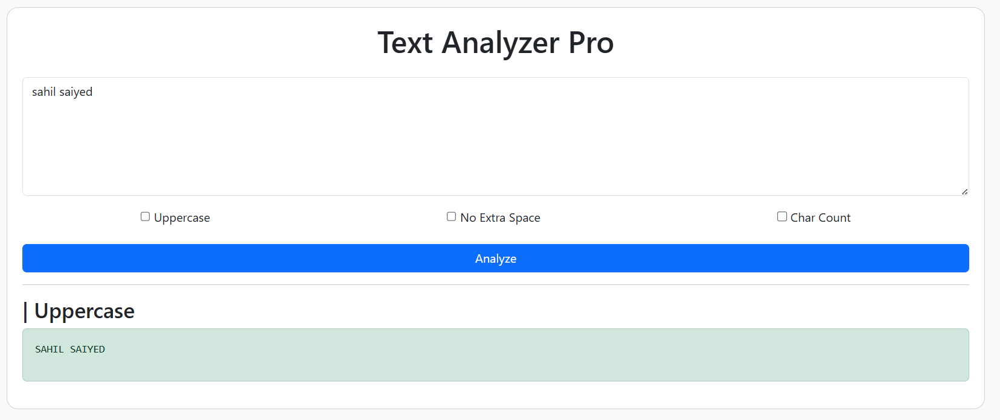

# 📝 Text Utility Tool (Project #01)

<p align="center">
  
  
  
</p>

---

## 📖 Project Overview
**Text Utility Tool** is a sophisticated web-based application developed using the **Django Web Framework**. It serves as a comprehensive utility for text manipulation, allowing users to perform operations like case conversion, whitespace cleaning, and character analysis through a seamless, real-time interface.

This project was built to master the fundamentals of **Django Template Language (DTL)** and backend-to-frontend data flow without the overhead of a database.

---

## 🚀 Application Preview
<p align="center">
  
</p>

---

## ✨ Key Features
*   🔠 **Uppercase Transformation:** Instantly convert blocks of text to uppercase for better readability or specific formatting needs.
*   🧹 **Whitespace Optimization:** An intelligent algorithm that detects and removes redundant spaces, leaving only single-space formatting.
*   📊 **Character Analytics:** Provides a real-time count of total characters for precision editing.
*   📱 **Responsive Design:** Fully optimized for mobile, tablet, and desktop environments using **Bootstrap 5**.

---

## 🛠️ Technical Stack
| Category | Technology |
| :--- | :--- |
| **Language** | Python 3.13 |
| **Framework** | Django 6.0 |
| **Frontend** | HTML5, CSS3, Bootstrap 5 |
| **Logic** | Python String Methods |

---

## 📂 Project Architecture
```text
project-1-Text Utility Tool/
├── core/               # Main Project Settings
├── home/               # Application Logic & Views
├── templates/          # UI Component Files
├── demo.png            # Visual Documentation
└── manage.py           # Django Utility Script
